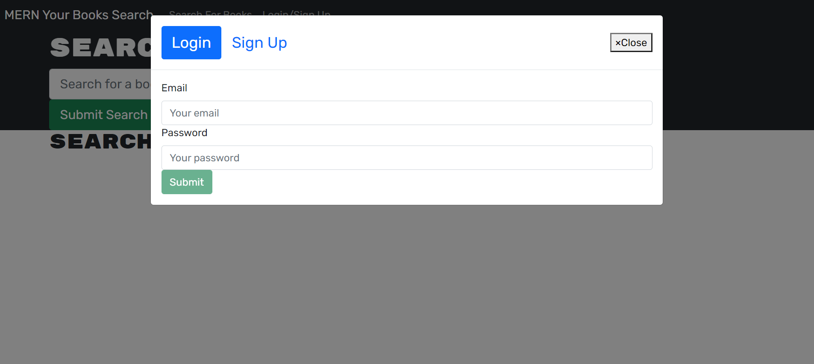
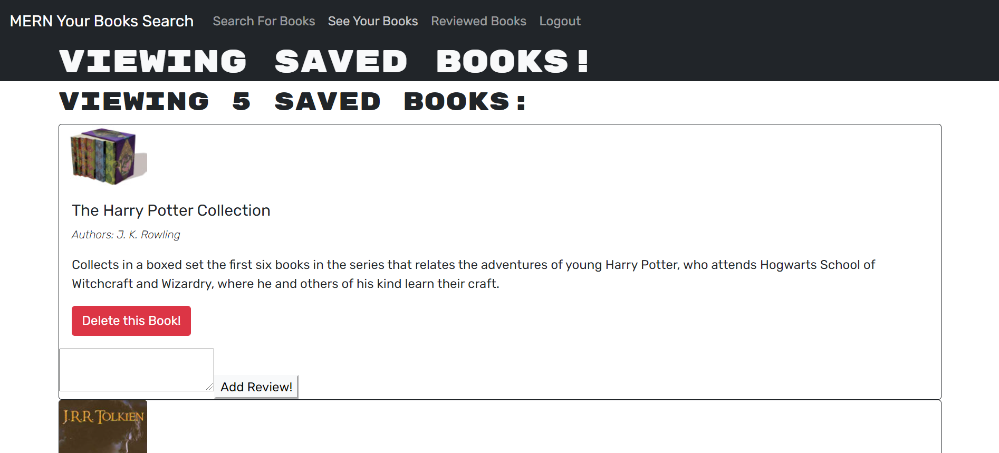

# BookStore

# Description

Name: BookStore

For our week 21 assignment, using starter code with a fully functioning Google Books API search engine built with a RESTful API, refactor it to be a GraphQL API built with Apollo Server. The app was built using the MERN stack with a React front end, MongoDB database, and Node.js/Express.js server and API. It's already set up to allow users to save book searches to the back end.

To complete the assignment, you’ll need to do the following:

    1. Set up an Apollo Server to use GraphQL queries and mutations to fetch and modify data, replacing the existing RESTful API.

    2. Modify the existing authentication middleware so that it works in the context of a GraphQL API.

    3. Create an Apollo Provider so that requests can communicate with an Apollo Server.

    4. Deploy your application to Heroku with a MongoDB database using MongoDB Atlas.

# Technologies Used

- HTML/CSS/Javascript
- Node.js
- Express.js
- MongoDB Atlas
- Heroku
- React

# Links

Github URL: https://github.com/trevorwiegand92/BookStore

Heroku URL: Heroku URL: https://mern-your-books.herokuapp.com/

# Screenshots

### Here's a screenshot of the finished index page.

#### Here's a screenshot of the login page.

#### Here's a screenshot of the saved books page.

